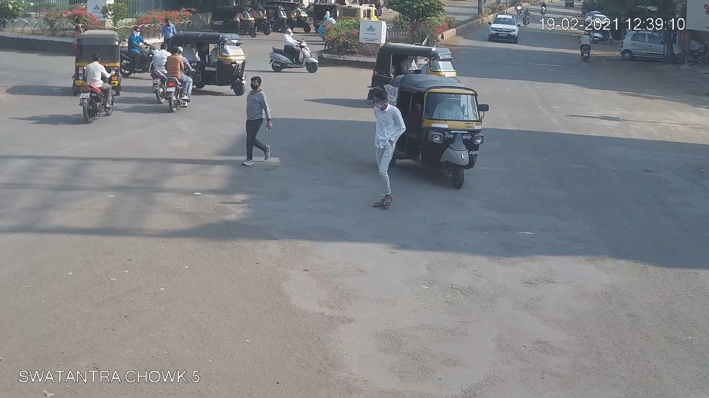
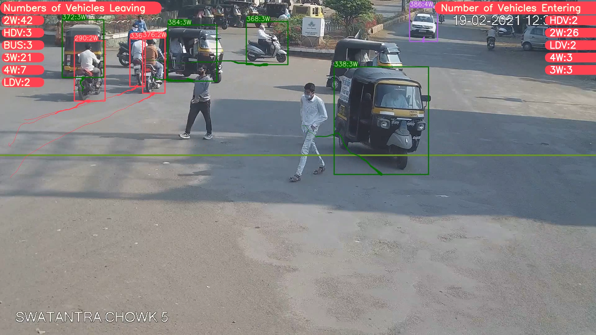

# YOLOv8-DeepSORT-Object-Tracking-and-Counting

## Google Collab Implementation
The collab file demonstrates how to set up the environment, train your custom model, and run the script to get results. The script produces an output video that detects and tracks different types of objects and counts them. It also produces a CSV file and saves it along with the output video. The CSV file shows the total count of different objects entering and leaving. 
## Steps to run the code on your local machine
* Clone the GitHub Repository
```bash
git clone https://github.com/SingManjot/YOLOv8-DeepSORT-Object-Tracking-and-Counting
```
* Goto the cloned folder
```bash
cd YOLOv8-DeepSORT-Object-Tracking-and-Counting
```
* Install the Dependencies
```bash
pip install -e '.[dev]'
```
* If you face any errors using the above command, you can use this instead
```bash
pip install -r requirements.txt
```
* Setting the directory. This is the directory that will contain our driver program (predict.py), DeepSORT files, Model (link for pre-trained model provided below), Test Video
```bash
cd ultralytics/yolo/v8/detect
```
* Download the DeepSORT folder, extract it, and place the folder deep_sort_pytorch into the subfolder specified above
```bash
https://drive.google.com/drive/folders/1aBYfUWkqYcJjrE4OiaDVFmfbugBMn_op?usp=sharing 
```
* Download the pre-trained Model (not required but recommended) and place it in the subfolder specified above
```bash
https://drive.google.com/file/d/1SIqT3Y7vOQyJ6aiUYd-dpLjrgvYUV0LK/view?usp=drive_link
```

* Download a Test Video and place the video in the subfolder specified above. To run the script, use the following command
```bash
python predict.py model=yolov8l.pt source="test.mp4" show=True
```
* If you are using the pre-trained model from the link provided above, use this command instead. Remember to place the Model in the subfolder specified above.
```bash
python predict.py model=best.pt source="test.mp4" show=True
```

## Results
* Screenshot of input video

* Screenshot of output video

| Vehicle Type | Entering Count | Leaving Count | Total Count |
|--------------|----------------|---------------|-------------|
| 2W           | 69             | 43            | 112         |
| HDV          | 3              | 2             | 5           |
| BUS          | 3              | 0             | 3           |
| 3W           | 37             | 3             | 40          |
| 4W           | 14             | 6             | 20          |
| LDV          | 2              | 2             | 4           |
